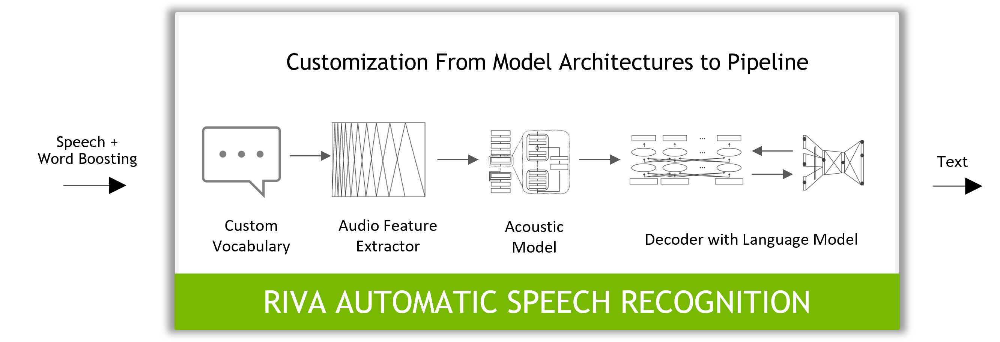

# ASR-Fine-Tuning-with-Nvidia-NeMo
With deep learning, the latest speech-to-text models are capable of recognition and translation of audio into text in real time! Good models can perform well in noisy environments, are robust to accents and have low word error rates (WERs).

Build, train, fine-tune, and deploy a GPU-accelerated
automatic speech recognition service (ASR) with NVIDIA Riva and NVIDIA NeMo. 

# NVIDIA Riva

[NVIDIA Riva](https://developer.nvidia.com/riva) is a GPU-accelerated SDK for building speech AI applications, customized for your use case, and delivering real-time performance.  
Riva offers a rich set of speech and natural language understanding services such as:

- Automated speech recognition ([ASR](https://docs.nvidia.com/deeplearning/riva/user-guide/docs/asr/asr-overview.html)).
- Text-to-Speech synthesis ([TTS](https://docs.nvidia.com/deeplearning/riva/user-guide/docs/tts/tts-overview.html)).
- Basic natural language processing ([NLP](https://docs.nvidia.com/deeplearning/riva/user-guide/docs/nlp/nlp-overview.html)) text and token classification functionality.
- Neural machine translation ([NMT](https://docs.nvidia.com/deeplearning/riva/user-guide/docs/translation/translation-overview.html)) between English and several other widely spoken languages, including Chinese, French, German, Russian, and Spanish.

The models and datasets are often quite large.  To streamline the process, some of these have been preloaded. In that case, the original steps are documented.
